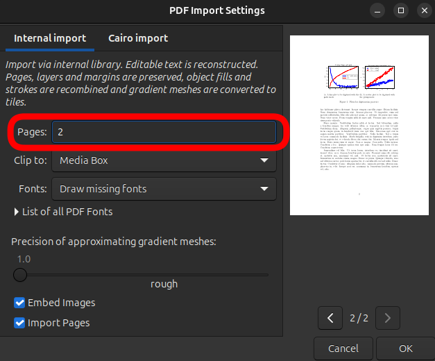
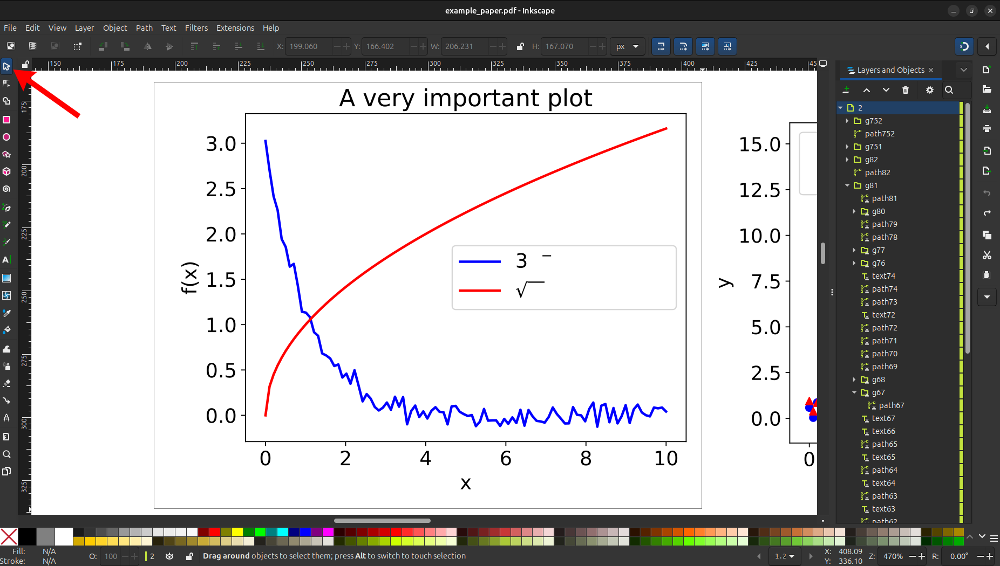
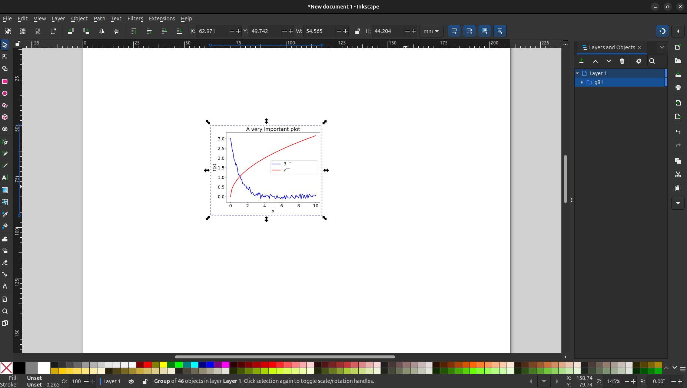
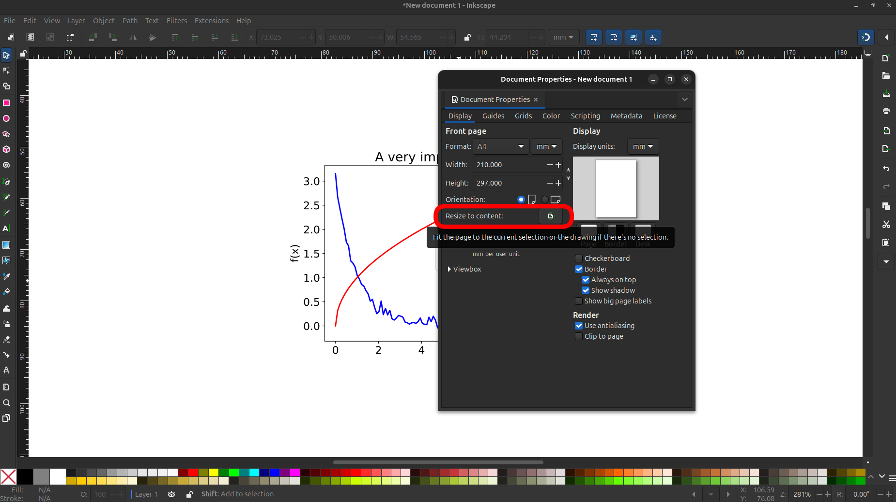
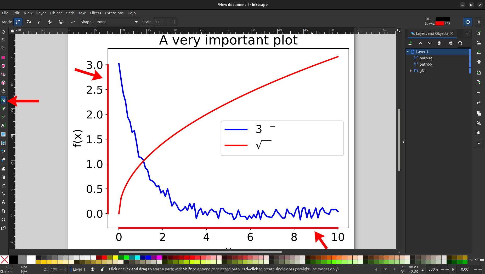
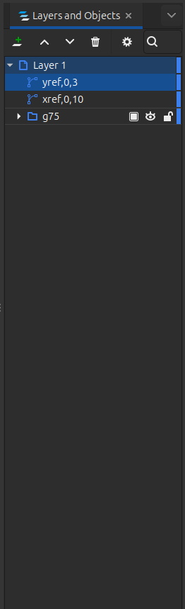
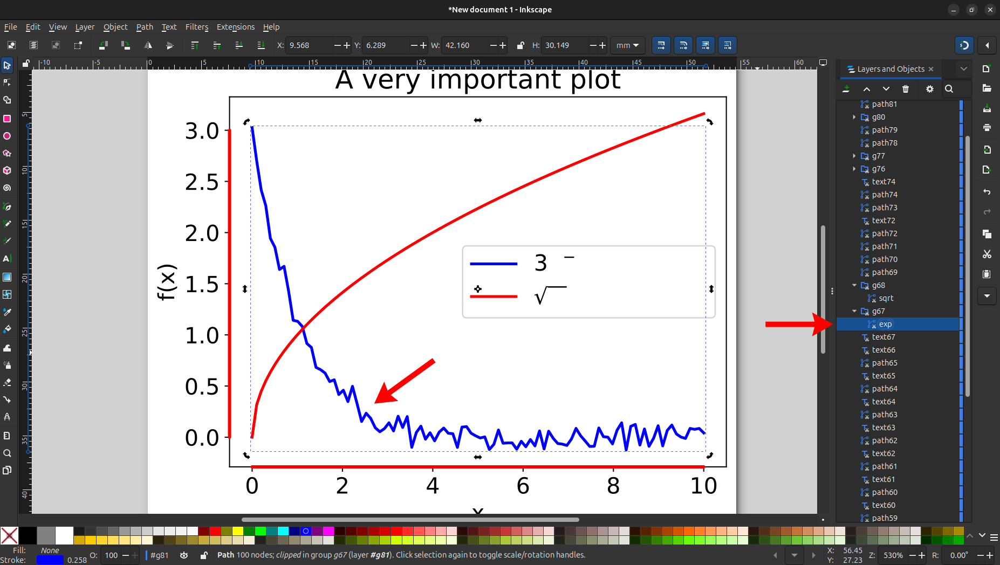
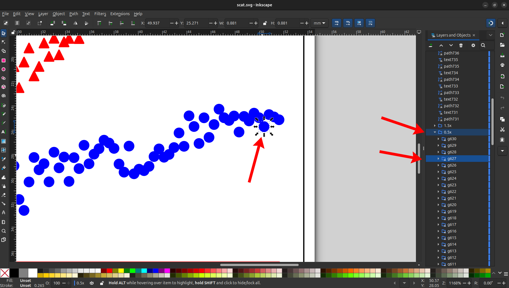

# Vector Plot Digitizer
Unfortunately, it is not common practice to share raw data along with plots in research
articles. This can make it difficult for other researchers to reproduce results or build
upon previous work, as it is not always possible to easily procure the data from the authors.

This simple script provides a solution by allowing researchers to extract data points from
vector-based plot images (e.g., SVG or PDF formats). By first doing some manual preprocessing,
converting to SVG format, and then running this script, users can obtain the underlying data
points used to create the plots.

## Preprocessing Steps
Before using the script, some manual preprocessing is required to indicate the data to be
extracted and to draw reference axes. To do this, you can use a vector graphics editor such as
[Inkscape](https://inkscape.org/). With your favorite editor, follow these steps. You can use
the [example document](example/example.pdf) to follow along and practice.

### Step 1: Isolate the Plot
First, open the paper in your vector graphics editor. Make sure to only open the page containing
the plot of interest to avoid a high load on your system.



Next, select the plot area using the selection tool and copy it to the clipboard. Note that
sometimes, you might need to double-click to enter a group before being able to select the plot.



Then, create a new document (File > New in Inkscape) and paste the copied plot into it.
This will isolate the plot from the rest of the page content. At this point, I also like to resize
the document to fit the content (File > Document Properties > Resize page to content in Inkscape)
to make it look nicer, but it's not mandatory.





### Step 2: Draw Reference Axes
To help the script understand the scale of the plot, you need to draw reference axes. First, use
the line tool to draw two straight lines, one along the x-axis and another along the y-axis.
These lines should start and end at points where you can easily read the corresponding data
values from the axis labels. To make it easier, you can zoom in and also rely on the snapping
feature of the editor. In Inkscape, to finish drawing a line, right-click or press Enter. In our
example, I drew the x-axis line from 0.0 to 10.0 and the y-axis line from 0.0 to 3.0. The default
line style is hard to see, since it's just a thin black line. To make it more visible, you can
change the stroke color and width. In Inkscape, you can do this by selecting the line and then
using the Fill and Stroke panel (Object > Fill and Stroke, or Shift+Ctrl+F). I like to work with
thick red lines for better visibility.



Now, it's time to open the layers and objects panel. In Inkscape, this is in the menu under
Layers > Layers and Objects. You can also use the shortcut Shift+Ctrl+L. In this panel, you will
see a list of all objects in the document. To locate the lines you just drew, use the selection
tool to click on each line, and the corresponding object will be highlighted in the panel.

[Locate Lines](screenshots/layers1.png)

Next, to let the script identify these lines and tell it which points they correspond to, you
need to rename them. In Inkscape, you can do this by double-clicking on the object name in the
layers and objects panel. The x-axis line name should be `xref` (this reference name can be
changed in the script arguments if needed), followed by the point you started and ended the line
at. For example, here it would be `xref,0,10`. You can separate the values with a white space or
any non-alphanumeric character, other that - or +. Similar to the x-axis line, rename the y-axis,
only labeling it as `yref` this time. In our example, the y-axis line name would be
`yref,0,3`. After renaming, the layers and objects panel should look like this:



### Step 3: Indicate Data to Extract
The last step is to label the data series you want to extract. There are two possibilities:

1. If the data is represented as lines, then you can simply rename the path corresponding to the
   data series. Here, I named the blue line as "exp" and the red line as "sqrt".
2. If the data is represented as scattered points, then you need to group together the points
   corresponding to each data series and name the group accordingly. In the example, I grouped
   the blue circles into a group named "0.5x" and the red triangles into a group named "1.5x".

Again, remember that in Inkscape, you might need to double-click on an area to enter a group
before being able to select an individual object.





Here are a few things to watch out for when labeling data series:
- In the case of lines, sometimes the plot may consist of multiple segments (due to
  discontinuities, gaps, or just weird formatting of the original figure). In such cases, you
  can simply merge all segments into a single path. In Inkscape, the simplest would be to select
  all segments and then use Path > Combine (Ctrl+K).
- Sometimes, a path may be very jagged and outline a thick line, rather than cleanly having each
  point represent a data point. In this case, the best you can do is to manually simplify the path
  in post-processing after extracting the data.
- In the case of scattered points, one data point might be represented by multiple overlapping
  shapes (e.g., a circle with a border). In these cases, I again recommend simplifying the shapes
  in post-processing. In this step, you can see the exact number of different shapes make up one
  data point, and also take note of any irregularities (e.g. offsets) to correct later.
- It can be difficult to select data points by hand in scatter plots. To make this easier, note
  that objects in the same scattering series are clustered together in the layers and objects
  panel. First, find the first and last object in the series. Then, by clicking on one of them in
  the panel, and then  Ctrl+Shift+Clicking on the other, you can select all objects in between
  these two.
- There are usually objects for making a white background behind the plot. Deleting these can help
  you select the data points more easily.

After completing these steps, save the document in SVG format. The file is now ready to be
processed by the script.

## Script Usage
To run the script, execute `digitize.py` it using Python. Make sure you have Numpy
installed in your environment. Here is the general usage:

```bash
python -m digitize [options] <input_svg_file> <labels...>
```

Where `<input_svg_file>` is the path to the preprocessed SVG file, and `<labels...>` are the
names of the data series you want to extract (as labeled in the previous steps). If you
want to extract scatter points, you need to select `group` mode by adding the `--mode group`
or `-m group` option.

The script will save the extracted data points into separate CSV files for each data series,
named `<filename>_<label>.csv`, where `<filename>` is the name of the input SVG file without
the extension, and `<label>` is the name of the data series. The CSV files will be saved in
the same directory as the input SVG file. To change this behavior, you can use the `--output`
or `-o` option to specify a different file path prefix for the output CSV files. For example,
using `-o data/mydata` will save the files as `mydata_<label>.csv` in the `data` directory.

As an example, for our practice document, I made the preprocessed SVG file for both plots.
For the [line plot](example/line.svg), we have

```bash
python -m digitize --mode path example/line.svg exp sqrt
```

which will generate `example/line_exp.csv` and `example/line_sqrt.csv`. The `--mode path`
is optional here, as the default mode is `path`. For the [scatter plot](example/scatter.svg),

```bash
python -m digitize --mode group example/scatter.svg 0.5x 1.5x
```
will generate `example/scatter_0.5x.csv` and `example/scatter_1.5x.csv`.

You can also choose the name of the reference axes by using the `--xref` (or `-x`) and
`--yref` (or `-y`) options. By default, these are set to `xref` and `yref`, respectively.

You can run these commands in the provided `line.sh` and `scatter.sh` scripts. All the files
used in the examples are included in the `example` directory.
